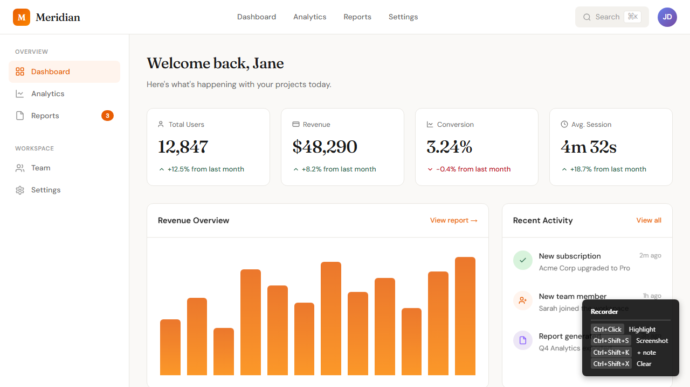
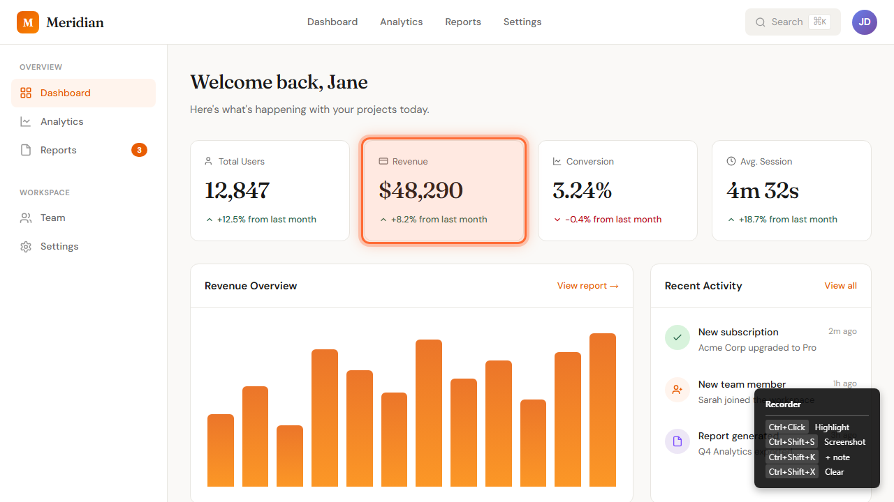
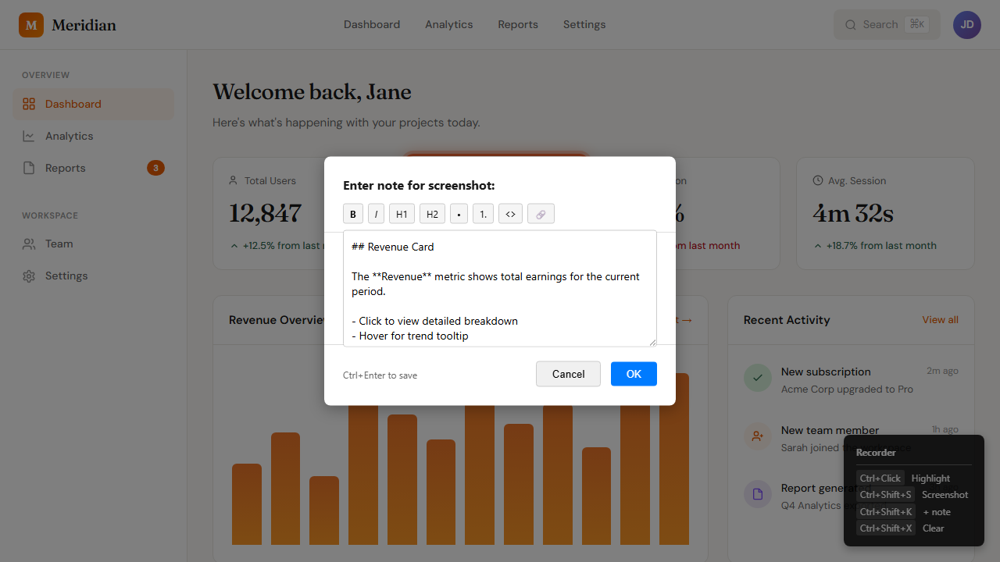

# Playwright Documentation Recorder

Record browser actions with on-demand screenshots and element highlighting. Generates rerunnable scripts and markdown documentation.



## Install

```bash
npm install
```

## Usage

```bash
node recorder.js <url> [output-dir] [viewport] [title]
```

Examples:
```bash
node recorder.js https://example.com ./my-docs
node recorder.js https://example.com ./my-docs 1920x1080
node recorder.js https://example.com ./my-docs 1280x720 "Getting Started Guide"
```

- Default viewport: 1280x720
- Title adds YAML front matter to generated markdown

## Shortcuts

### Mouse
| Action | Result |
|--------|--------|
| `Ctrl+Click` | Highlight clicked element |

### Keyboard
| Shortcut | Action |
|----------|--------|
| `Ctrl+Shift+S` | Take screenshot |
| `Ctrl+Shift+K` | Screenshot with note (opens markdown editor) |
| `Ctrl+Shift+X` | Clear highlight |
| `Ctrl+C` | Stop recording and save |

A shortcuts legend is displayed in the browser during recording and automatically hidden when taking screenshots.

## Highlighting Elements

Use `Ctrl+Click` on any element to highlight it with an orange overlay. The highlight persists across screenshots until cleared with `Ctrl+Shift+X`.



## Adding Notes

When using `Ctrl+Shift+K`, a dialog appears with a markdown toolbar:
- Formatting buttons: **B** (Bold), *I* (Italic), H1, H2, • (Bullet), 1. (Numbered), `<>` (Code), 🔗 (Link)
- `Ctrl+Enter` to save, `Escape` to cancel
- Notes are included in `screenshots.md` and printed during replay



## Output

After recording, you get:
- `recorded-script.js` - Rerunnable Playwright script
- `screenshots/` - All captured screenshots
- `screenshots.md` - Markdown documentation with optional front matter and embedded screenshots
- `actions.json` - Raw action log (includes title, viewport, and actions)

Example `screenshots.md` with title:
```markdown
---
title: "Getting Started Guide"
---

## Step 1: Click Login


---
```

## Replay

```bash
node doc-output/recorded-script.js
```

This re-executes all actions, regenerates screenshots and `screenshots.md`, and prints notes to the console.

## Video Generation

Generate videos from recorded sessions using `generate-recording.js`:

```bash
node generate-recording.js ./doc-output/actions.json
node generate-recording.js ./doc-output/actions.json -f gif -o ./my-recording
```

Options:
| Option | Description | Default |
|--------|-------------|---------|
| `-o, --output <dir>` | Output directory | ./recording-output |
| `-f, --format <fmt>` | Format: mp4, gif, webm | mp4 |
| `--fps <n>` | Frame rate | 2 |
| `--note-position <pos>` | Note overlay: top, bottom | bottom |

Requires [ffmpeg](https://ffmpeg.org/) for video encoding.

## How It Works

1. Opens a browser with the specified viewport
2. Records clicks, form inputs, and navigation automatically
3. Use `Ctrl+Click` to highlight any element
4. Use `Ctrl+Shift+S` to capture screenshots
5. Use `Ctrl+Shift+K` to add markdown notes with screenshots
6. Press `Ctrl+C` when done - generates replay script and documentation
