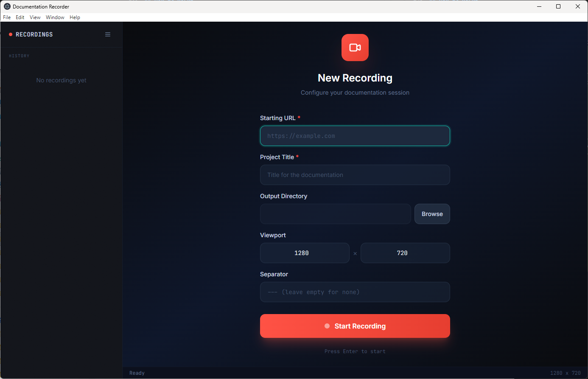

# Playwright Documentation Recorder

Record browser actions with on-demand screenshots and element highlighting. Generates rerunnable scripts and markdown documentation.

This is an npm workspaces monorepo with three packages:

| Package | Description |
|---------|-------------|
| `@doc-recorder/cli` | Command-line recorder tool |
| `@doc-recorder/desktop` | Electron desktop app with GUI |
| `@doc-recorder/shared` | Shared utilities (script/markdown generation) |

## Install

```bash
npm install
```

## Desktop App



Launch the Electron desktop app for a graphical recording experience:

```bash
npm run desktop
```

Features:
- Visual recording controls with start/stop buttons
- URL history and recent recordings sidebar
- Viewport presets (HD, Full HD, Mobile, Tablet, Custom)
- Screenshots-only mode (skip recording clicks/form inputs)
- Custom CSS injection (hide cookie banners, popups, etc.)
- Refetch screenshots from existing recordings
- Draggable recorder panel (constrained to viewport)
- Built-in markdown editor for recorded documentation
- Slugified markdown filenames based on project title

## CLI Usage

```bash
npm run record <url> [options]
```

Options:
| Option | Description | Default |
|--------|-------------|---------|
| `-o, --output <dir>` | Output directory | ./doc-output |
| `-v, --viewport <size>` | Viewport (WIDTHxHEIGHT) | 1280x720 |
| `-t, --title <title>` | Document title (adds YAML front matter) | none |
| `-s, --separator <sep>` | Screenshot separator in markdown | `---` |
| `--screenshots-only` | Only capture screenshots (skip click/fill recording) | false |
| `-c, --css <css>` | Custom CSS to inject (hide elements, etc.) | none |
| `-cf, --css-file <path>` | Path to CSS file to inject | none |
| `--refetch <dir>` | Refetch screenshots from existing recording | - |

Examples:
```bash
npm run record https://example.com
npm run record https://example.com -o ./my-docs -v 1920x1080
npm run record https://example.com -t "Getting Started Guide"
npm run record https://example.com --screenshots-only
npm run record -- --refetch ./doc-output
```

Alternative (legacy):
```bash
node recorder.js <url> [output-dir] [viewport] [title]
```


## Shortcuts

### Mouse
| Action | Result |
|--------|--------|
| `Ctrl+Click` | Highlight clicked element |

### Keyboard
| Shortcut | Action |
|----------|--------|
| `Ctrl+Shift+S` | Take screenshot |
| `Ctrl+Shift+K` | Screenshot with note (opens markdown editor) |
| `Ctrl+Shift+X` | Clear highlight |
| `Ctrl+C` | Stop recording and save |

A shortcuts legend is displayed in the browser during recording and automatically hidden when taking screenshots.

## Highlighting Elements

Use `Ctrl+Click` on any element to highlight it with an orange overlay. The highlight persists across screenshots until cleared with `Ctrl+Shift+X`.


## Adding Notes

When using `Ctrl+Shift+K`, a dialog appears with a markdown toolbar:
- Formatting buttons: **B** (Bold), *I* (Italic), H1, H2, • (Bullet), 1. (Numbered), `<>` (Code), 🔗 (Link)
- `Ctrl+Enter` to save, `Escape` to cancel
- Notes are included in `screenshots.md` and printed during replay


## Output

After recording, you get:
- `recorded-script.js` - Rerunnable Playwright script
- `screenshots/` - All captured screenshots
- `<title>.md` - Markdown documentation (filename is slugified title, e.g., "Getting Started" → `getting-started.md`)
- `actions.json` - Raw action log (includes title, viewport, and actions)

Example `screenshots.md` with title:
```markdown
---
title: "Getting Started Guide"
---

## Step 1: Click Login


---
```

## Replay

```bash
node doc-output/recorded-script.js
```

This re-executes all actions, regenerates screenshots and markdown, and prints notes to the console.

## Refetch Screenshots

Regenerate screenshots from an existing recording without re-recording actions:

```bash
# CLI
npm run record -- --refetch ./doc-output

# Desktop
# Click "Refetch" button on any recording in the history sidebar
```

This replays only `goto` and `screenshot` actions, useful for updating screenshots after website changes.

## Screenshots-Only Mode

Record screenshots without capturing clicks or form inputs. Useful when entering credentials:

```bash
npm run record https://example.com --screenshots-only
```

In desktop app, uncheck "Record actions" before starting. A warning reminds you that credentials would be stored in `actions.json` when recording is enabled.

## CSS Injection

Inject custom CSS to hide cookie consent banners, popups, or other unwanted elements during recording:

```bash
# Inline CSS
npm run record https://example.com -c ".cookie-banner { display: none !important; }"

# From file
npm run record https://example.com -cf ./hide-elements.css
```

In the desktop app, check "Inject custom CSS" to reveal a textarea where you can enter CSS rules or load them from a file. CSS is injected on all pages and persists across navigation.

## Video Generation

Generate videos from recorded sessions using `generate-recording.js`:

```bash
node generate-recording.js ./doc-output/actions.json
node generate-recording.js ./doc-output/actions.json -f gif -o ./my-recording
```

Options:
| Option | Description | Default |
|--------|-------------|---------|
| `-o, --output <dir>` | Output directory | ./recording-output |
| `-f, --format <fmt>` | Format: mp4, gif, webm | mp4 |
| `--fps <n>` | Frame rate | 2 |
| `--note-position <pos>` | Note overlay: top, bottom | bottom |

Requires [ffmpeg](https://ffmpeg.org/) for video encoding.

## How It Works

### CLI
1. Opens a browser with the specified viewport
2. Records clicks, form inputs, and navigation automatically
3. Use `Ctrl+Click` to highlight any element
4. Use `Ctrl+Shift+S` to capture screenshots
5. Use `Ctrl+Shift+K` to add markdown notes with screenshots
6. Press `Ctrl+C` when done - generates replay script and documentation

### Desktop App
1. Click "+" in the sidebar to start a new recording
2. Enter URL, title, and select viewport preset (or custom dimensions)
3. Optionally disable "Record actions" for screenshots-only mode
4. Click "Start Recording" and interact with the page
5. Use keyboard shortcuts or the draggable recorder panel to capture screenshots
6. Click "Stop" when done - recordings are saved to the sidebar
7. Use "Refetch" to regenerate screenshots from existing recordings

## Project Structure

```
packages/
├── cli/           # Command-line recorder (@doc-recorder/cli)
├── desktop/       # Electron app (@doc-recorder/desktop)
└── shared/        # Shared utilities (@doc-recorder/shared)
```

### Development

```bash
# Run CLI
npm run record <url>

# Run desktop app (dev mode)
npm run desktop

# Build desktop app
npm run desktop:build
```
